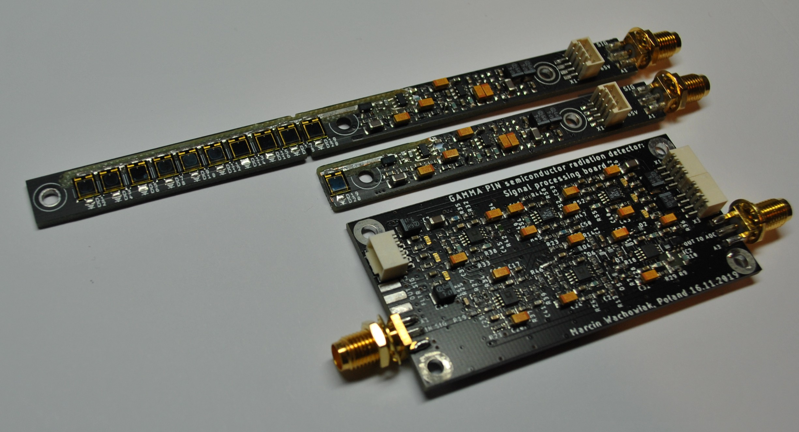
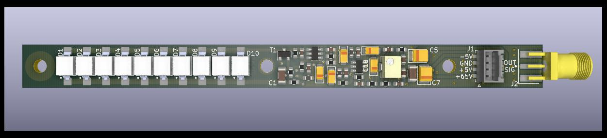
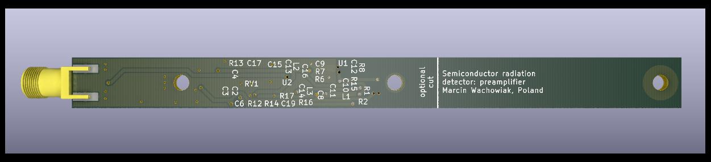
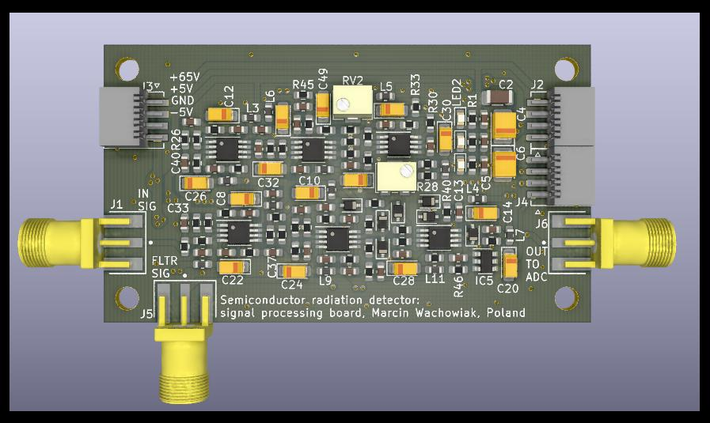
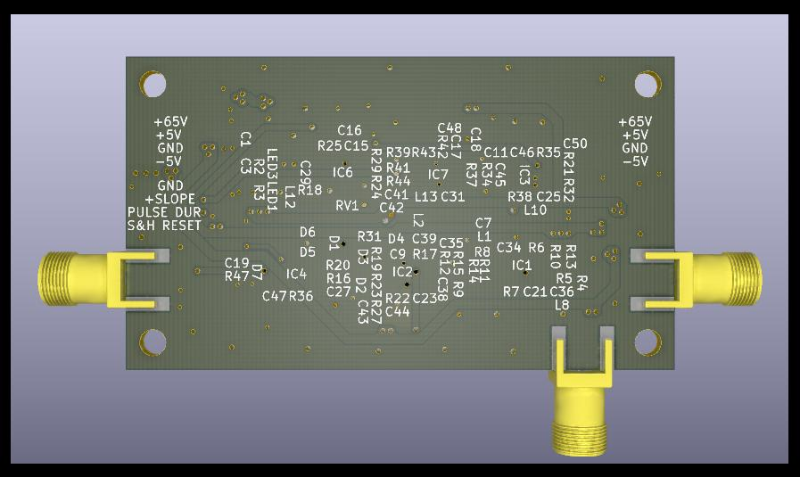

# Semiconductor Radiation Detector

Radiation detector based on PIN diode with extensive signal processing. The signal chain consists of multiple stages such as bootstrapped preamplifier, filtering, baseline restorer, sample and hold, and set of comparators detecting slopes of pulses. The signal processing board provides analog output for ADC along with digital signals triggering measurements. <a href="https://hackaday.io/project/159909-gamma-pin-semiconductor-radiation-detector">Hackaday project log</a>

 

  - **Manufactured prototypes**
  
    

 

  - **Preamplifier board**

    
    

 

  - **Signal processing board**
    
    
    

